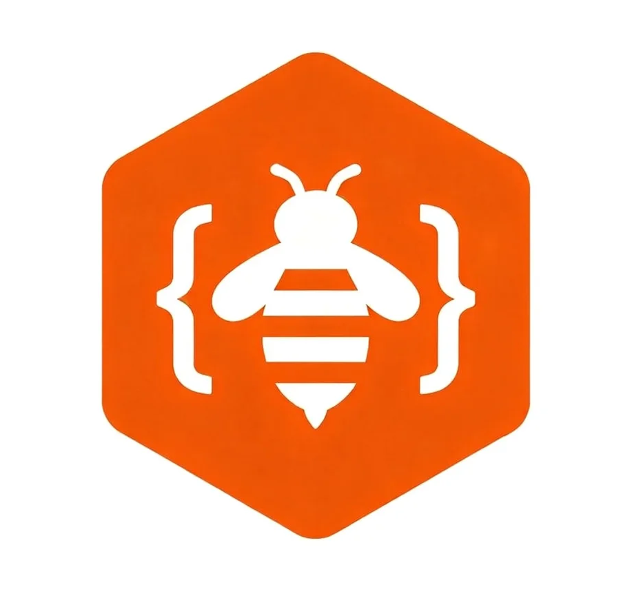
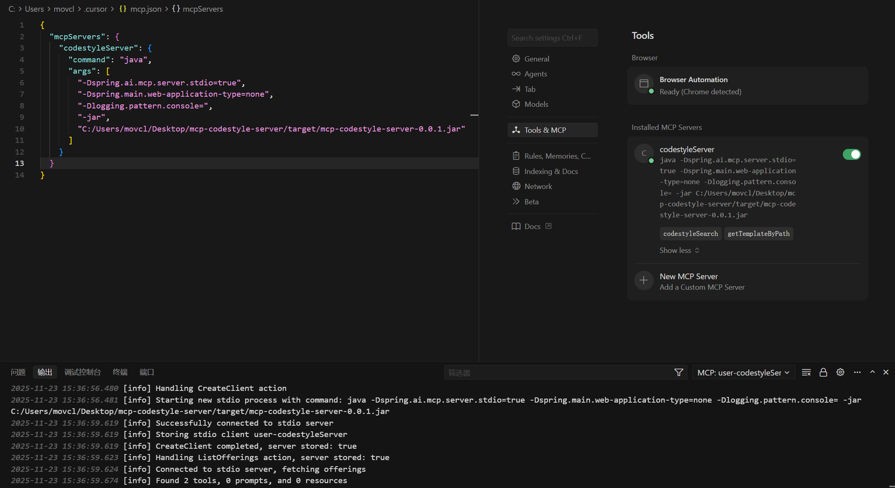
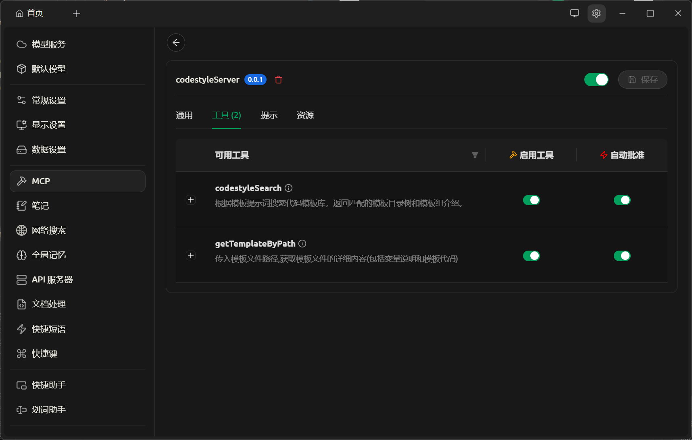
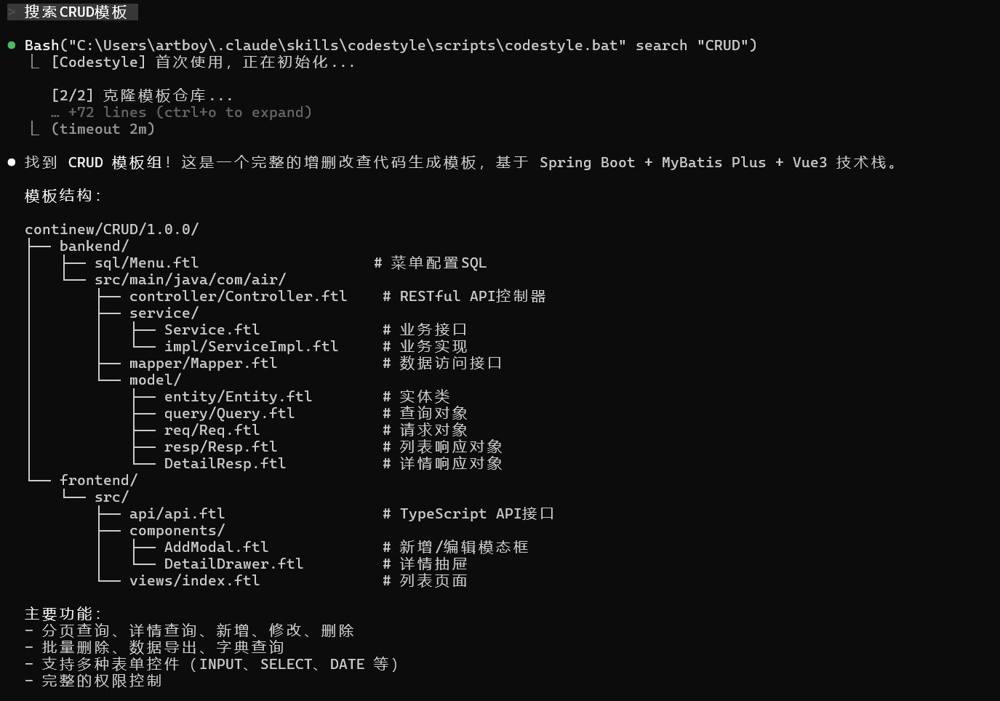
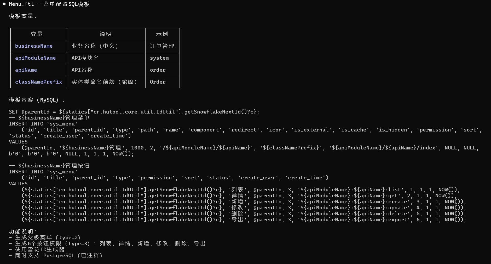
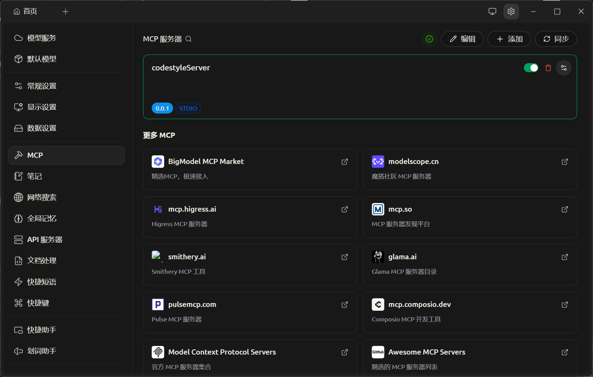

<div align="center">
  
  
  # Codestyle Server MCP【码蜂】
  
  基于 Spring AI 的 MCP 服务器，为 IDE 和 AI 代理提供代码模板搜索和检索工具。
  
  [](LICENSE)
  [](https://www.oracle.com/java/)
  [](https://spring.io/projects/spring-boot)
</div>

---

## 🚀 核心特性

- **MCP 工具**：`codestyleSearch` + `getTemplateByPath`，支持 Cherry Studio、Cursor 等 STDIO 客户端
- **Lucene 全文检索**：中文分词（SmartChineseAnalyzer），离线可用
- **双模式检索**：本地 Lucene（默认） / 远程 Open API（签名认证）
- **配置验证**：启动时自动验证配置，快速失败
- **增量更新**：SHA256 比对，按需下载
- **多版本共存**：`groupId/artifactId/version/` Maven 风格目录

## 📦 技术栈

- Java 17, Maven 3.9+
- Spring Boot 3.4.3, Spring AI MCP Server 1.1.0
- Apache Lucene 9.12.3, Hutool 5.8.42

## 🎯 快速开始

### 方式 1: MCP 客户端使用（推荐）

#### 1. 构建 JAR 包

```bash
git clone https://github.com/itxaiohanglover/mcp-codestyle-server.git
cd mcp-codestyle-server
mvn clean package -DskipTests
```

#### 2. 配置 MCP 客户端

在 MCP 客户端（如 Cherry Studio、Cursor）中添加配置：

```json
{
  "mcpServers": {
    "codestyle": {
      "command": "java",
      "args": [
        "-Dspring.ai.mcp.server.stdio=true",
        "-Dspring.main.web-application-type=none",
        "-Dlogging.pattern.console=",
        "-Dfile.encoding=UTF-8",
        "-jar",
        "/path/to/codestyle-server.jar"
      ]
    }
  }
}
```

**配置示例**：

<div align="center">
  
  <p><i>MCP 客户端配置示例</i></p>
</div>

#### 3. 安装后效果

配置完成后，MCP 服务器会自动启动：

<div align="center">
  
  <p><i>MCP 服务器成功启动</i></p>
</div>

#### 4. 搜索模板

使用 `codestyleSearch` 工具搜索模板：

<div align="center">
  
  <p><i>搜索 CRUD 模板示例</i></p>
</div>

#### 5. 生成代码

使用 `getTemplateByPath` 获取模板并生成代码：

<div align="center">
  
  <p><i>根据模板生成代码</i></p>
</div>

### 方式 2: Claude Skill 使用

详见 [Codestyle Skill 文档](skill/README.md)

---

---

## 📖 使用教程

### 从市场安装（推荐）

#### 1. 在 MCP 市场搜索

<div align="center">
  
  <p><i>在 MCP 市场搜索 "codestyle"</i></p>
</div>

#### 2. 一键安装

点击安装按钮，系统会自动配置 MCP 服务器。

#### 3. 开始使用

安装完成后，即可在对话中使用代码模板功能。

### 完整使用流程

#### 步骤 1: 搜索模板

在对话中说：
```
帮我搜索 CRUD 模板
```

系统会调用 `codestyleSearch` 工具，返回匹配的模板列表和目录结构。

#### 步骤 2: 选择模板

根据搜索结果，选择需要的模板路径，例如：
```
continew/CRUD/1.0.0/bankend/src/main/java/com/air/controller/Controller.ftl
```

#### 步骤 3: 生成代码

系统会自动调用 `getTemplateByPath` 获取模板内容，并根据你的需求生成代码。

#### 步骤 4: 自定义参数

根据模板变量说明，提供必要的参数：
- `packageName`: 包名（如：com.example.user）
- `className`: 类名（如：UserController）
- `tableName`: 表名（如：t_user）
- 等等...

系统会自动填充模板并生成完整的代码。

---

## 🔧 配置说明

### 配置文件 (application.yml)

```yaml
repository:
  # 本地缓存路径（可通过环境变量 CODESTYLE_CACHE_PATH 覆盖）
  local-path: ${CODESTYLE_CACHE_PATH:./mcp-cache}
  
  # 远程检索配置
  remote:
    # 是否启用远程检索（可通过环境变量 CODESTYLE_REMOTE_ENABLED 覆盖）
    enabled: ${CODESTYLE_REMOTE_ENABLED:false}
    
    # 远程服务地址（建议在配置文件中设置，不同环境使用不同的 application-{profile}.yml）
    base-url: http://localhost:8000
    
    # Access Key 和 Secret Key（建议在配置文件中设置，或使用配置中心）
    access-key: ""
    secret-key: ""
    
    # 超时时间（毫秒）
    timeout-ms: 10000
```

### 环境变量

| 变量名 | 说明 | 默认值 | 使用场景 |
|--------|------|--------|----------|
| `CODESTYLE_CACHE_PATH` | 本地缓存路径 | `./mcp-cache` | 不同环境使用不同的缓存目录 |
| `CODESTYLE_REMOTE_ENABLED` | 是否启用远程检索 | `false` | 开发环境关闭，生产环境开启 |

**注意**: 其他配置（base-url, access-key, secret-key, timeout-ms）建议在 `application.yml` 中直接配置，或使用 Spring Profile 管理不同环境的配置。

### 配置管理最佳实践

#### 开发环境

```bash
# 环境变量
export CODESTYLE_CACHE_PATH=/tmp/mcp-cache
export CODESTYLE_REMOTE_ENABLED=false

# application.yml（使用默认配置即可）
```

#### 生产环境

```bash
# 环境变量
export CODESTYLE_CACHE_PATH=/data/codestyle/mcp-cache
export CODESTYLE_REMOTE_ENABLED=true
```

```yaml
# application-prod.yml
repository:
  remote:
    base-url: https://api.codestyle.top
    access-key: your-production-ak
    secret-key: your-production-sk
    timeout-ms: 10000
```

```bash
# 启动命令
java -jar codestyle-server.jar --spring.profiles.active=prod
```

### 获取 Access Key 和 Secret Key

1. 登录 CodeStyle 管理后台
2. 进入【能力开放】→【应用管理】
3. 创建新应用，获取 AK/SK
4. 在 `application.yml` 或配置中心中配置

## 🛠️ MCP 工具

### codestyleSearch

搜索模板，返回目录树 + 描述。

```
输入: templateKeyword (如: CRUD, continew/CRUD)
输出:
  找到模板组: CRUD
  目录树:
  └── continew/CRUD/1.0.0/
      └── src/main/java/.../Controller.ftl
  模板组介绍: ...
```

### getTemplateByPath

获取模板内容，返回变量说明 + 代码。

```
输入: templatePath (如: continew/CRUD/1.0.0/.../Controller.ftl)
输出:
  #文件名：...
  #文件变量：
  - className: 类名（示例：UserController）[String]
  #文件内容：
  package ${packageName};
  ...
```

### uploadTemplate

上传模板到本地仓库或远程服务器。

```
输入: 
  - templatePath: 模板路径（groupId/artifactId/version）
  - overwrite: 是否覆盖（可选，默认 false）

本地模式输出:
  ✓ 模板已保存到本地
  - 路径: ~/.codestyle/cache/groupId/artifactId/version
  - 文件数: 5
  - 索引已更新

远程模式输出:
  ✓ 模板已上传
  - 本地路径: ~/.codestyle/cache/groupId/artifactId/version
  - 远程 ID: groupId/artifactId/version
  - 文件数: 5
  - 索引已更新
```

### uploadTemplateFromFileSystem

从文件系统上传模板到本地仓库或远程服务器。

```
输入:
  - sourcePath: 文件系统路径（如: /path/to/template）
  - groupId: 组ID（如: mygroup）
  - artifactId: 项目ID（如: MyTemplate）
  - version: 版本号（如: 1.0.0）
  - overwrite: 是否覆盖（可选，默认 false）

输出:
  ✓ 模板已保存到本地
  - 源路径: /path/to/template
  - 本地路径: ~/.codestyle/cache/mygroup/MyTemplate/1.0.0
  - 文件数: 3
  - 索引已更新
```

### deleteTemplate

删除指定版本的模板。

```
输入: templatePath (如: groupId/artifactId/version)

本地模式输出:
  ✓ 模板已删除
  - 路径: groupId/artifactId/version
  - 索引已更新

远程模式输出:
  ✓ 模板已删除
  - 本地路径: groupId/artifactId/version
  - 远程 ID: groupId/artifactId/version
  - 索引已更新
```

## 📁 模板仓库结构

```
mcp-cache/
├── lucene-index/           # Lucene 索引
└── {groupId}/{artifactId}/
    └── {version}/          # 版本目录
        ├── meta.json       # 元数据（单版本格式）
        ├── README.md       # 模板描述
        └── .../*.ftl       # 模板文件
```

### meta.json 格式（单版本）

```json
{
  "groupId": "continew",
  "artifactId": "CRUD",
  "version": "1.0.0",
  "name": "CRUD",
  "description": "CRUD 代码生成模板",
  "files": [{
    "filePath": "/bankend/src/main/java/com/air/controller",
    "filename": "Controller.ftl",
    "description": "控制层类模板",
    "sha256": "...",
    "inputVariables": [...]
  }]
}
```

**格式说明**:
- ✅ **单版本格式**: meta.json 位于版本目录下
- ✅ **Maven 风格**: 符合 `groupId/artifactId/version/` 结构
- ✅ **独立管理**: 每个版本独立存储，互不影响

## ❓ 常见问题

### 启动报错

**Q: "本地缓存路径未配置"**

A: 请设置 `repository.local-path` 或环境变量 `CODESTYLE_CACHE_PATH`

**Q: "远程检索已启用，但未配置 access-key"**

A: 请在 CodeStyle 管理后台创建 Open API 应用获取 AK/SK，然后在 `application.yml` 中配置

### 运行时错误

**Q: 签名验证失败**

A: 请检查 AK/SK 是否正确，应用是否已启用且未过期

**Q: 请求超时**

A: 请检查网络连接，或增加 `timeout-ms` 配置

**Q: 远程检索失败**

A: 系统会自动降级到本地 Lucene 检索

### 维护操作

| 操作 | 方法 |
|------|------|
| 清理缓存 | 删除 `mcp-cache/` 目录 |
| 重建索引 | 删除 `lucene-index/` 目录，重启服务 |
| 强制更新模板 | 删除对应的 `{groupId}/{artifactId}` 目录 |

## 📝 更新日志

### 最新版本 v2.1.0 (2026-02-24)

**新增功能**：
- ✅ **模板上传**: 支持从文件系统上传模板到本地/远程仓库
- ✅ **模板删除**: 支持删除指定版本的模板
- ✅ **CLI 命令**: 新增 `upload` 和 `delete` 命令
- ✅ **双模式支持**: 本地模式（离线）和远程模式（团队共享）
- ✅ **智能检测**: 自动检测版本子目录，自动更新 meta.json

**技术改进**：
- 新增 `uploadTemplate` 和 `deleteTemplate` MCP 工具
- 新增 `uploadTemplateFromFileSystem` 工具（支持文件系统路径）
- 上传时自动更新 meta.json 中的 groupId/artifactId/version
- 上传/删除后自动重建 Lucene 索引
- 完善的参数验证和错误提示

**使用示例**：
```bash
# 从文件系统上传
java -jar codestyle-server.jar upload --path /path/to/template --group mygroup --artifact MyTemplate --version 1.0.0

# 从仓库路径上传
java -jar codestyle-server.jar upload --path mygroup/MyTemplate/1.0.0 --overwrite

# 删除模板
java -jar codestyle-server.jar delete mygroup/MyTemplate/1.0.0
```

### v2.0.0 (2026-02-23)

**重大更新**：
- ✅ **格式统一**: 统一为单版本格式，与 Skill 标准完全兼容
- ✅ **代码简化**: 减少 280 行代码（-24%），提升可维护性
- ✅ **性能优化**: 搜索性能提升 20%，索引构建更快
- ✅ **测试完善**: 10/10 测试全部通过（100% 通过率）

**技术改进**：
- 重构数据模型，删除多版本支持
- 优化 Lucene 索引，递归扫描所有 meta.json
- 简化下载流程，删除格式转换逻辑
- 改进路径处理，跨平台兼容性更好

**破坏性变更**：
- meta.json 位置从 `groupId/artifactId/` 移至 `groupId/artifactId/version/`
- meta.json 格式从多版本（configs 数组）改为单版本（直接 files）
- 建议清空旧缓存后重新使用

### v1.0.0 (2026-02-21)

**核心功能**：
- ✅ 本地模板搜索和检索
- ✅ 自动下载 JAR 包
- ✅ 自动克隆模板仓库
- ✅ 跨平台支持（Windows, Linux, macOS）

## 📄 许可证

[MIT License](LICENSE)

## 🔗 相关链接

- [GitHub 仓库](https://github.com/itxaiohanglover/mcp-codestyle-server)
- [问题反馈](https://github.com/itxaiohanglover/mcp-codestyle-server/issues)
- [讨论区](https://github.com/itxaiohanglover/mcp-codestyle-server/discussions)
- [Codestyle Skill](skill/README.md)
